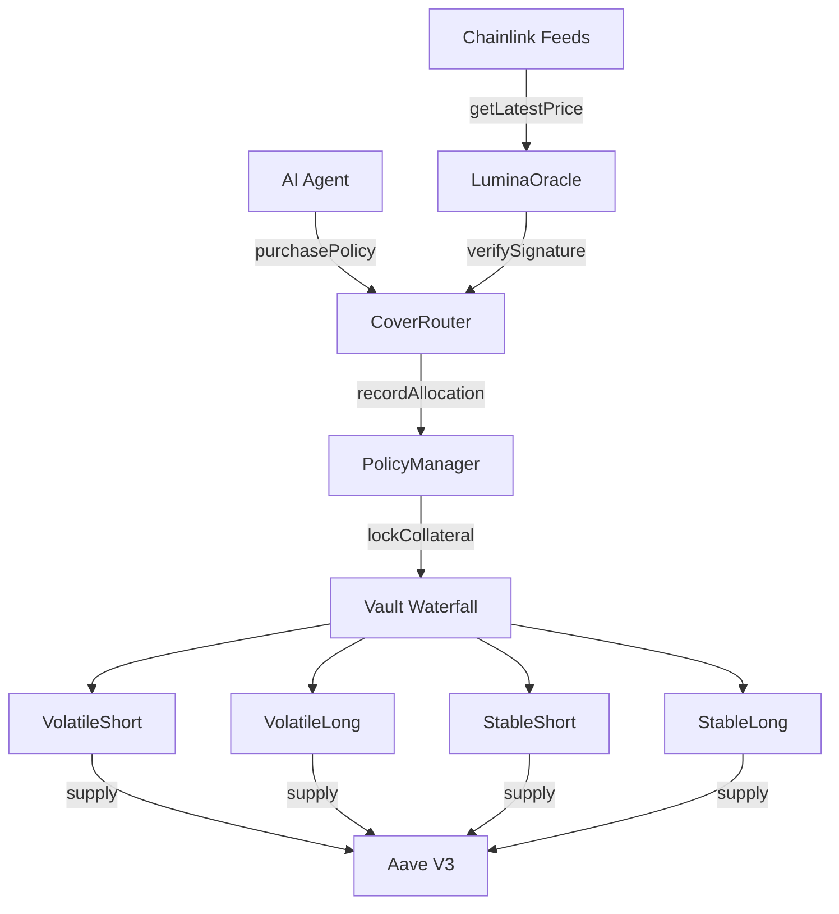

# Lumina Protocol

**Parametric insurance protocol for AI agents on Base L2**

  

Lumina Protocol is an on-chain parametric insurance system designed for autonomous AI agents operating on Base L2. It combines Chainlink price feeds with Phala TEE attestations to offer fully automated, machine-to-machine coverage products — including BTC catastrophe shields, ETH apocalypse shields, stablecoin depeg shields, impermanent-loss index cover, and exploit insurance — with binary or proportional payouts settled in USDC and idle capital earning yield through Aave V3.

## Contract Addresses

| Contract | Address |
|----------|---------|
| CoverRouter | [0xd5f8678A...](https://basescan.org/address/0xd5f8678A0F2149B6342F9014CCe6d743234Ca025) |
| PolicyManager | [0xCCA07e06...](https://basescan.org/address/0xCCA07e06762222AA27DEd58482DeD3d9a7d0162a) |
| LuminaOracle | [0x4d1140Ac...](https://basescan.org/address/0x4d1140Ac8F8cB9d4fB4f16cAe9C9cBA13C44bC87) |
| VolatileShort Vault | [0xbd445475...](https://basescan.org/address/0xbd44547581b92805aAECc40EB2809352b9b2880d) |
| VolatileLong Vault | [0xFee5d6DA...](https://basescan.org/address/0xFee5d6DAdA0A41407e9EA83d4F357DA6214Ff904) |
| StableShort Vault | [0x429b6d7d...](https://basescan.org/address/0x429b6d7d6a6d8A62F616598349Ef3C251e2d54fC) |
| StableLong Vault | [0x1778240E...](https://basescan.org/address/0x1778240E1d69BEBC8c0988BF1948336AA0Ea321c) |
| TimelockController | [0xd0De5D53...](https://basescan.org/address/0xd0De5D53dCA2D96cdE7FAf540BA3f3a44fdB747a) |
| Gnosis Safe (2-of-3) | [0xa17e8b7f...](https://basescan.org/address/0xa17e8b7f985022BC3c607e9c4858A1C264b33cFD) |
| BTCCatastropheShield (BCS) | [0x36e37899...](https://basescan.org/address/0x36e37899D9D89bf367FA66da6e3CebC726Df4ce8) |
| ETHApocalypseShield (EAS) | [0xA755D134...](https://basescan.org/address/0xA755D134a0b2758E9b397E11E7132a243f672A3D) |
| DepegShield | [0x7578816a...](https://basescan.org/address/0x7578816a803d293bbb4dbea0efbed872842679d0) |
| ILIndexCover | [0x2ac0d2a9...](https://basescan.org/address/0x2ac0d2a9889a8a4143727a0240de3fed4650dd93) |
| ExploitShield | [0x9870830c...](https://basescan.org/address/0x9870830c615d1b9c53dfee4136c4792de395b7a1) |
| BlackSwanShield (BSS) | [0x54CDc21D...](https://basescan.org/address/0x54CDc21DEDA49841513a6a4A903dc0A0a9e7844e) *(deprecated — replaced by BCS+EAS)* |

## Architecture



## Quick Start

```bash
forge build && forge test
```

## Documentation

- [Protocol Documentation](docs/)
- [OpenAPI Specification](docs/openapi.yaml)
- [Whitepaper](docs/whitepaper.pdf)

## Security

See [SECURITY.md](SECURITY.md) for the responsible disclosure policy, audit history, and bug bounty details.

## License

MIT
