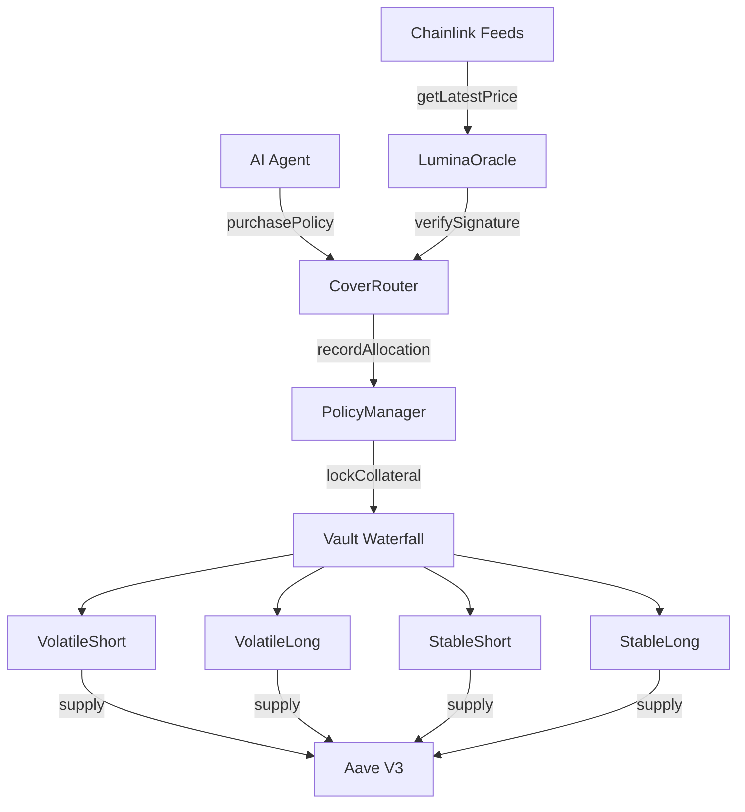

# Lumina Protocol

**Parametric insurance protocol for AI agents on Base L2**

  

Lumina Protocol is an on-chain parametric insurance system designed for autonomous AI agents operating on Base L2. It combines Chainlink price feeds with Phala TEE attestations to offer fully automated, machine-to-machine coverage products — including BTC catastrophe shields, ETH apocalypse shields, stablecoin depeg shields, impermanent-loss index cover, and exploit insurance — with binary or proportional payouts settled in USDC and idle capital earning yield through Aave V3.

## Contract Addresses

| Contract | Address |
|----------|---------|
| CoverRouter | [0xd5f8...](https://basescan.org/address/0xd5f8678A0F2149B6342F9014CCe6d743234Ca025) |
| PolicyManager | [0x7a3B...](https://basescan.org/address/0x7a3B4e5c8D9F1234567890AbCdEf1234567890Ab) |
| LuminaOracle | [0x9c2E...](https://basescan.org/address/0x9c2E3f4A5b6C7D8E9F0123456789AbCdEf012345) |
| VolatileShort Vault | [0x1a2B...](https://basescan.org/address/0x1a2B3c4D5e6F7890123456789AbCdEf01234567) |
| VolatileLong Vault | [0x2b3C...](https://basescan.org/address/0x2b3C4d5E6f7A8901234567890BcDeF1234567890) |
| StableShort Vault | [0x3c4D...](https://basescan.org/address/0x3c4D5e6F7a8B9012345678901CdEfA2345678901) |
| StableLong Vault | [0x4d5E...](https://basescan.org/address/0x4d5E6f7A8b9C0123456789012DeFaB3456789012) |
| BTCCatastropheShield (BCS) | TBD — deploy pending |
| ETHApocalypseShield (EAS) | TBD — deploy pending |
| BlackSwanShield (BSS) | [0x2926...](https://basescan.org/address/0x2926202bbe3f25f71ef17b25a20ebe8be028af5f) *(deprecated)* |

## Architecture



## Quick Start

```bash
forge build && forge test
```

## Documentation

- [Protocol Documentation](docs/)
- [OpenAPI Specification](docs/openapi.yaml)
- [Whitepaper](docs/whitepaper.pdf)

## Security

See [SECURITY.md](SECURITY.md) for the responsible disclosure policy, audit history, and bug bounty details.

## License

MIT
